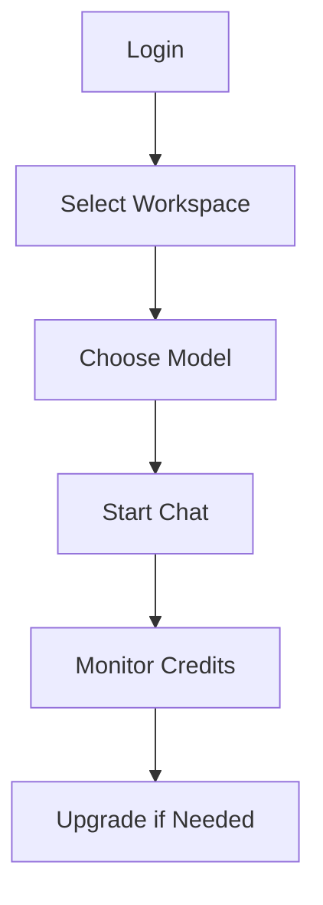

## Overview

WiseSpark provides a powerful platform for AI-driven conversations, collaborative workspaces, and efficient billing management. You can interact with advanced AI models through an intuitive chat interface, customize your experience with model settings, organize projects in workspaces, and monitor your credits seamlessly.

<Columns cols={3}>
  <Card title="AI Chat Interface" icon="message-circle" href="#chat-interface">
    Engage in natural conversations with multiple AI models.
  </Card>
  <Card title="Model Settings" icon="settings" href="#model-settings">
    Switch and configure AI models for optimal performance.
  </Card>
  <Card title="Workspaces" icon="layers" href="#workspaces">
    Create and manage team spaces for organized collaboration.
  </Card>
  <Card title="Billing & Credits" icon="credit-card" href="#billing">
    Track subscriptions, credits, and usage effortlessly.
  </Card>
</Columns>

## Chat Interface

Access the chat interface from your dashboard at `https://app.wisespark.com/chat` to start conversations instantly.

<Steps>
  <Step title="Start a New Chat" icon="plus">
    Click the `+ New Chat` button in the sidebar.

    Select a topic or type your first message directly.
  </Step>
  <Step title="Interact with AI" icon="message-circle">
    Enter your query and press `Enter`.

    The AI responds in real-time. Use `@mention` for specific models.
  </Step>
  <Step title="Save and Share" icon="share-2">
    Pin important chats or export conversations as PDFs.
  </Step>
</Steps>

<Callout kind="tip">
  For best results, provide context in your prompts, such as `Summarize this report for executives`.
</Callout>

## Model Settings

WiseSpark supports multiple AI models like GPT-4, Claude, and custom fine-tuned options. Configure them via the settings menu.

<Tabs>
  <Tab title="Switch Models" icon="swap">
    Open the model selector in the chat header.

    Choose from available models and adjust parameters like temperature (0-1 for creativity).

    ```javascript
    // Example model config in advanced settings
    {
      model: "gpt-4-turbo",
      temperature: 0.7,
      maxTokens: 2000
    }
    ```
  </Tab>
  <Tab title="Custom Models" icon="cpu">
    Upload your fine-tuned model via `Settings > Models > Add Custom`.

    Test it immediately in a new chat.
  </Tab>
</Tabs>

## Workspaces

Workspaces keep your projects organized, with role-based access for teams.

<Steps>
  <Step title="Create Workspace" icon="plus">
    Navigate to `Workspaces > New Workspace`.

    Name it (e.g., "Marketing Campaign") and set visibility.
  </Step>
  <Step title="Invite Members" icon="users">
    Go to `Members > Invite` and add emails.

    Assign roles: Admin, Editor, Viewer.
  </Step>
  <Step title="Manage Chats" icon="folder">
    Move chats between workspaces via drag-and-drop.
  </Step>
</Steps>

<Expandable title="Advanced Workspace Permissions" default-open="false">
  Customize permissions for chats, models, and integrations per workspace.

  Use the `Permissions` tab to restrict model access.
</Expandable>

## Billing and Credits

Monitor your subscription, credits, and usage in the `Billing` section.

| Feature       | Description                          | Location          |
|---------------|--------------------------------------|-------------------|
| View Credits | Check remaining credits and usage   | `Billing > Credits` |
| Upgrade Plan | Switch to Pro or Enterprise         | `Billing > Plans`  |
| Add Credits  | Purchase top-up credits             | `Billing > Buy`    |

<Callout kind="info">
  Subscriptions renew automatically. Set usage alerts to avoid running out of credits.
</Callout>



<Columns cols={2}>
  <Card title="Quickstart Guide" icon="book-open" href="/quickstart">
    Set up your first workspace.
  </Card>
  <Card title="Authentication" icon="shield" href="/authentication">
    Secure your account.
  </Card>
</Columns>