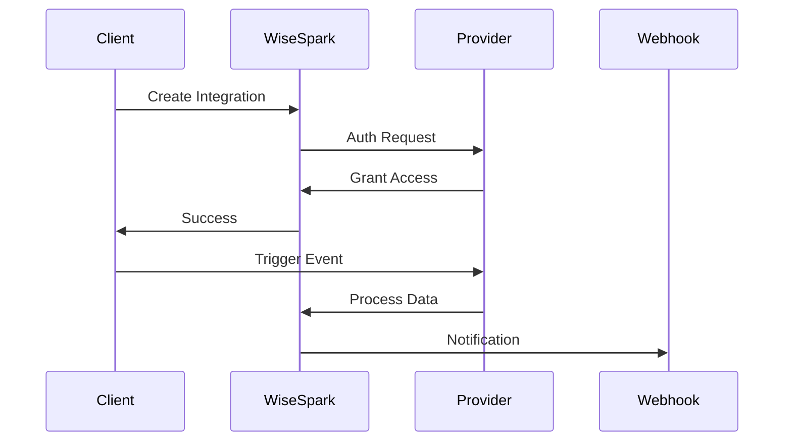

## Overview

WiseSpark supports seamless integrations with popular third-party services, webhooks for real-time notifications, and custom API connections. Use these features to automate workflows, sync data, and extend functionality across your tools.

<Callout kind="info">
Review your workspace permissions before setting up integrations. Admin access is required for most configurations.
</Callout>

## Popular Integrations

Connect WiseSpark to your favorite tools using pre-built integrations.

<Columns cols={3}>
  <Card title="Slack" icon="message-circle" href="https://slack.com">
    Send AI responses and notifications directly to Slack channels.
  </Card>
  <Card title="Zapier" icon="zap" href="https://zapier.com">
    Automate workflows with 5000+ apps via no-code zaps.
  </Card>
  <Card title="Discord" icon="users" href="https://discord.com">
    Integrate chat responses into Discord servers and bots.
  </Card>
</Columns>

## Setting Up Third-Party Integrations

Follow these steps to connect a service like Zapier.

<Steps>
  <Step title="Create Integration" icon="plus">
    Navigate to Workspace Settings > Integrations. Select your provider and click "Connect".
  </Step>
  <Step title="Authorize Access" icon="key">
    Grant permissions in the popup window. Use your WiseSpark API key if prompted.
  </Step>
  <Step title="Configure Triggers" icon="settings">
    Choose events like "New Chat Message" as triggers and define actions.
  </Step>
  <Step title="Test Connection" icon="play">
    Send a test event and verify it appears in the target service.
  </Step>
</Steps>

## Configuring Webhooks

Set up webhooks to receive real-time updates from WiseSpark.

### Generate Webhook URL

1. Go to Workspace > Webhooks > New Webhook.
2. Enter your endpoint URL, e.g., `https://your-webhook-url.com/webhook`.
3. Select events like `chat.message.created`.

### Sample Payload

<CodeGroup tabs="JavaScript,Python">
  ````javascript
  // Incoming webhook payload
  const payload = {
    event: "chat.message.created",
    data: {
      id: "msg_123",
      content: "Hello from WiseSpark!",
      user: { id: "user_456", name: "Jane Doe" }
    },
    timestamp: 1699123456
  };
  ````
  ````python
  # Incoming webhook payload
  payload = {
      "event": "chat.message.created",
      "data": {
          "id": "msg_123",
          "content": "Hello from WiseSpark!",
          "user": {"id": "user_456", "name": "Jane Doe"}
      },
      "timestamp": 1699123456
  }
  ````
</CodeGroup>

<Callout kind="tip">
Secure your webhook endpoint with HMAC signatures. Verify the `X-WiseSpark-Signature` header.
</Callout>

## Admin Tools for Permissions

Manage integration access with admin controls.

<Tabs>
  <Tab title="Role-Based Access" icon="shield">
    Assign roles like "Integration Admin" to team members.

    | Role              | Webhook Access | API Permissions |
    |-------------------|----------------|-----------------|
    | Admin             | Full           | Read/Write      |
    | Editor            | Create/Read    | Read            |
    | Viewer            | Read Only      | Read            |
  </Tab>
  <Tab title="Audit Logs" icon="file-text">
    Review integration activity in Admin > Audit Logs. Filter by user or service.
  </Tab>
</Tabs>

## Custom API Usage

For advanced connections, use the WiseSpark API.

<ParamField path="webhook" param-type="string" required="true">
Your webhook endpoint URL.
</ParamField>

<ParamField header="Authorization" param-type="string" required="true">
Bearer `{YOUR_API_KEY}`.
</ParamField>

### Create Webhook Example

<Request tabs="cURL,JavaScript">
  ````bash
  curl -X POST https://api.example.com/v1/webhooks \
    -H "Authorization: Bearer YOUR_API_KEY" \
    -H "Content-Type: application/json" \
    -d '{
      "url": "https://your-webhook-url.com/webhook",
      "events": ["chat.message.created"]
    }'
  ````
  ````javascript
  const response = await fetch('https://api.example.com/v1/webhooks', {
    method: 'POST',
    headers: {
      'Authorization': 'Bearer YOUR_API_KEY',
      'Content-Type': 'application/json'
    },
    body: JSON.stringify({
      url: 'https://your-webhook-url.com/webhook',
      events: ['chat.message.created']
    })
  });
  ````
</Request>

<Response tabs="201,400">
  ```json
  {
    "id": "wh_789",
    "url": "https://your-webhook-url.com/webhook",
    "events": ["chat.message.created"],
    "active": true
  }
  ```

  ```json
  {
    "error": "Invalid URL format"
  }
  ```
</Response>

## Best Practices

- Rotate API keys regularly in Admin settings.
- Test integrations in a staging workspace first.
- Monitor usage quotas via the dashboard at `https://dashboard.example.com`.

<Expandable title="Advanced: Integration Flow" default-open="false">

</Expandable>